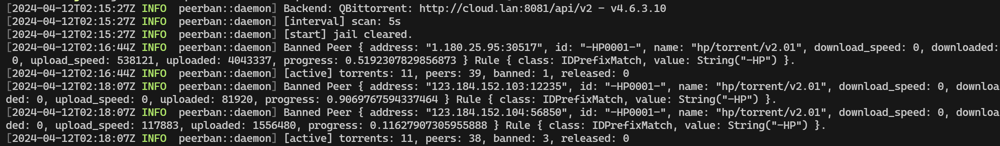

# PeerBan

零配置全自动全平台吸血客户端封禁器，现处于早期开发阶段，欢迎 PR。

```shell
Usage: peerban [OPTIONS]

Options:
  -b, --backend <BACKEND>    [default: qb]
  -e, --endpoint <ENDPOINT>  [default: http://127.0.0.1:8080]
  -a, --auth <AUTH>          [default: admin:admin]
  -s, --scan <SCAN>          Scan interval in seconds. [default: 5]
  -c, --clear                Clear all bans before start.
  -h, --help                 Print help
```



## Features

- 零配置，只需通过命令行传递连接参数
- 高性能，一般内存占用小于 3 MB
- 启发式封锁，除预置规则外，会自动封禁 `假进度上报/超量下载` 客户端
- 支持多种后端，目前支持 `qBittorrent`
- 永封，你也可以在启动时加入 `-c` 参数解封全部重新封

## Installation

```shell
cargo install --git https://github.com/jerrita/peerban
```

> Docker & Binary is WIP

## Backend Supports

- [x] qBittorrent

## Contributes

> 欢迎 PR，如果你有任何问题或建议，欢迎提出 Issue。

- 后端适配参考 `backend/qb.rs`，你只需要实现 `Backend` trait 中的四个函数即可。
- 新增内置规则参考 `rules/preload.rs`，新增一行即可。

## RoadMap

- [x] ProtoType
- [ ] Container
- [ ] WebUI
- [ ] Rule Hot-Update

## Similar Projects

- [PeerBanHelper](https://github.com/Ghost-chu/PeerBanHelper)
- [qBittorrent-ClientBlocker](https://github.com/Simple-Tracker/qBittorrent-ClientBlocker)